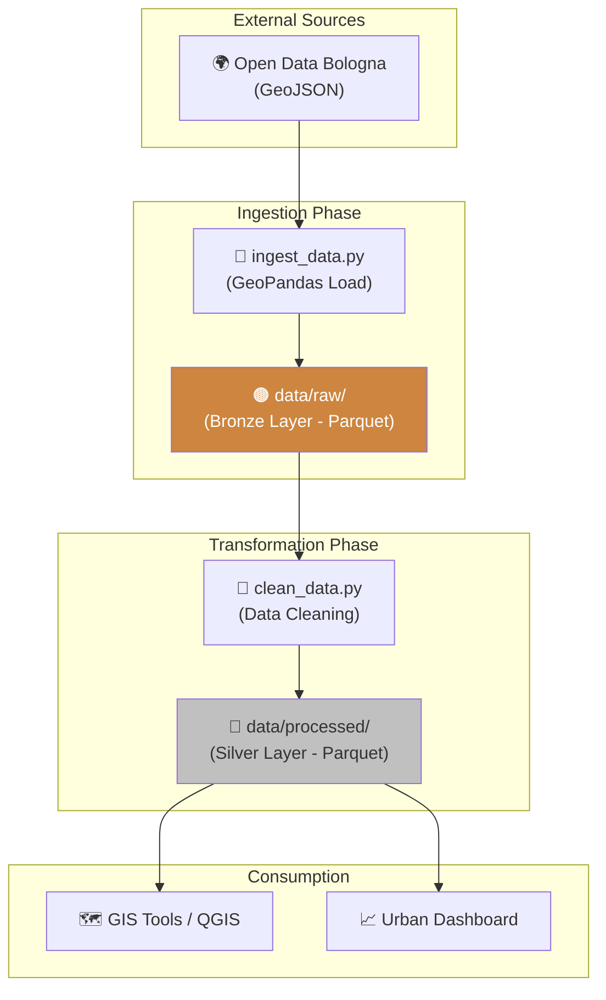
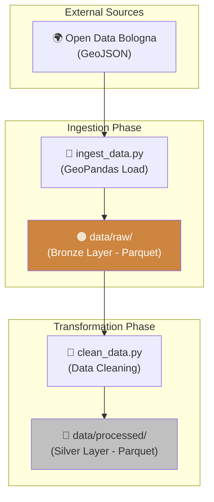

# 🚲 Bologna CycleMap: Geospatial Data Engineering Pipeline

<p align="center">
  
  
  
  
  
</p>

**Bologna CycleMap** è una pipeline di Data Engineering specializzata nel dominio geospaziale. Il progetto implementa l'ingestione, la validazione e la trasformazione di dataset territoriali open source (GeoJSON) provenienti dal Comune di Bologna, convertendoli in Data Products ottimizzati (Parquet) pronti per l'analisi spaziale avanzata e l'integrazione in sistemi GIS o dashboard di monitoraggio urbano.

## 🏢 Valore Enterprise & Settori di Applicazione

| Settore / Ambito | Rilevanza & Benefici |
|-------------------|-----------|
| **Smart City & PA** | Gestione e monitoraggio delle infrastrutture urbane tramite pipeline automatizzate per Open Data territoriali. |
| **Mobilità Sostenibile** | Analisi dei flussi e della copertura della rete ciclabile per il supporto alle decisioni (Data-Driven Policy Making). |
| **Logistica e Trasporti** | Integrazione di vincoli geografici e infrastrutturali in algoritmi di routing e ottimizzazione dell'ultimo miglio. |
| **Utilities & Real Estate** | Correlazione tra asset fisici e coordinate geografiche per la manutenzione territoriale e la valutazione degli immobili. |

---

## 🎯 Executive Summary & Valore di Business
Il progetto dimostra la capacità di gestire la complessità dei dati geospaziali (coordinate, geometrie LineString, proiezioni) trasformandoli in un formato analitico efficiente.

### 🏛️ 1. Architettura Medallion per Dati Spaziali
* **Bronze Layer (Raw):** Ingestione del GeoJSON grezzo con persistenza in Parquet per preservare la fedeltà del dato originario riducendo l'occupazione di memoria.
* **Silver Layer (Processed):** Pulizia profonda, normalizzazione dei nomi delle colonne (snake_case), rimozione di valori nulli e standardizzazione delle stringhe, rendendo il dato "query-ready".

### 🌍 2. Expertise Geospaziale (GeoPandas)
* **Validazione Geometrie:** Verifica dell'integrità spaziale dei dati durante la fase di ingestione.
* **Efficienza Formati:** Transizione dal formato GeoJSON (estremamente pesante per i sensori e la rete) al formato Parquet, che mantiene le proprietà geometriche riducendo drasticamente i tempi di I/O e ottimizzando la compressione.

### 🧪 3. Data Quality & Standards
* **Type Safety:** Enforcement dei tipi di dato (float per lunghezze, int per anni, string per categorie) per evitare errori silenti nelle fasi di analisi a valle.
* **Scalabilità:** Pipeline strutturata in moduli indipendenti (`ingest_data.py`, `clean_data.py`) che possono essere facilmente orchestrati (es. con Airflow) per gestire aggiornamenti periodici.

---

## 🏗️ Architettura Pipeline



## 🛠️ Stack Tecnologico

| Layer | Tecnologia | Ruolo |
|:------|:-----------|:-----|
| 🐍 **Language** | Python 3.10+ | Core development |
| 🌍 **Geospatial** | GeoPandas | Geospatial Data Manipulation |
| 🐼 **Data Analysis** | pandas | Data cleaning & structuring |
| 📦 **Storage** | Parquet | High-performance columnar storage |
| 🧩 **Architecture** | Medallion | Raw → Processed separation |

## 🚀 Setup

```bash
# Installazione dipendenze
pip install -r requirements.txt

# Esecuzione Pipeline
python src/ingest_data.py    # Ingestione e conversione Bronze
python src/clean_data.py     # Pulizia e produzione Silver
```

<br><br>

*Progettato e sviluppato da Eugenio Pasqua.*

---

# 🇬🇧 ENGLISH VERSION

# 🚲 Bologna CycleMap: Geospatial Data Engineering Pipeline

<p align="center">
  
  
  
</p>

**Bologna CycleMap** is a Data Engineering pipeline specialized in the geospatial domain. The project implements the ingestion, validation, and transformation of open-source territorial datasets (GeoJSON) from the City of Bologna, converting them into optimized Data Products (Parquet) ready for advanced spatial analysis and integration into GIS systems or urban monitoring dashboards.

## 🏢 Enterprise Value & Application Sectors

| Sector / Domain | Relevance & Benefits |
|-------------------|-----------|
| **Smart City & Gov** | Urban infrastructure management and monitoring via automated pipelines for territorial Open Data. |
| **Sustainable Mobility** | Network coverage and flow analysis to support Data-Driven Policy Making. |
| **Logistics & Transport** | Integration of geographic and infrastructural constraints into routing and last-mile optimization algorithms. |
| **Utilities & Real Estate** | Correlation between physical assets and geographic coordinates for territorial maintenance and property valuation. |

---

## 🎯 Executive Summary & Business Value
The project demonstrates the capability to handle the complexity of geospatial data (coordinates, LineString geometries, projections) by transforming them into an efficient analytical format.

### 🏛️ 1. Medallion Architecture for Spatial Data
* **Bronze Layer (Raw):** Raw GeoJSON ingestion with Parquet persistence to preserve original data fidelity while reducing memory footprint.
* **Silver Layer (Processed):** Deep cleaning, column name normalization (snake_case), null removal, and string standardization, making the data "query-ready".

### 🌍 2. Geospatial Expertise (GeoPandas)
* **Geometry Validation:** Verification of data's spatial integrity during the ingestion phase.
* **Format Efficiency:** Transition from GeoJSON (heavy for sensors and networks) to Parquet, which maintains geometric properties while slashing I/O times and optimizing compression.

---

## 🏗️ Pipeline Architecture



## 🧰 Technology Stack

`Python 3.10+` · `GeoPandas` · `pandas` · `Parquet` · `Medallion Architecture`

<br><br>

*Designed and developed by Eugenio Pasqua.*
